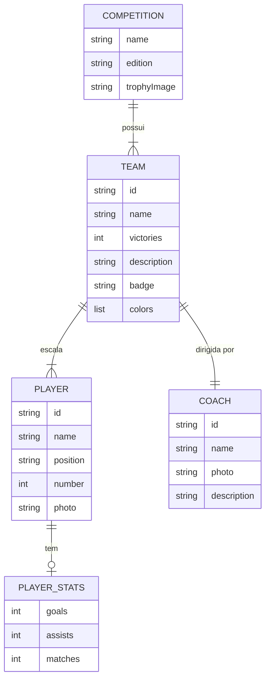
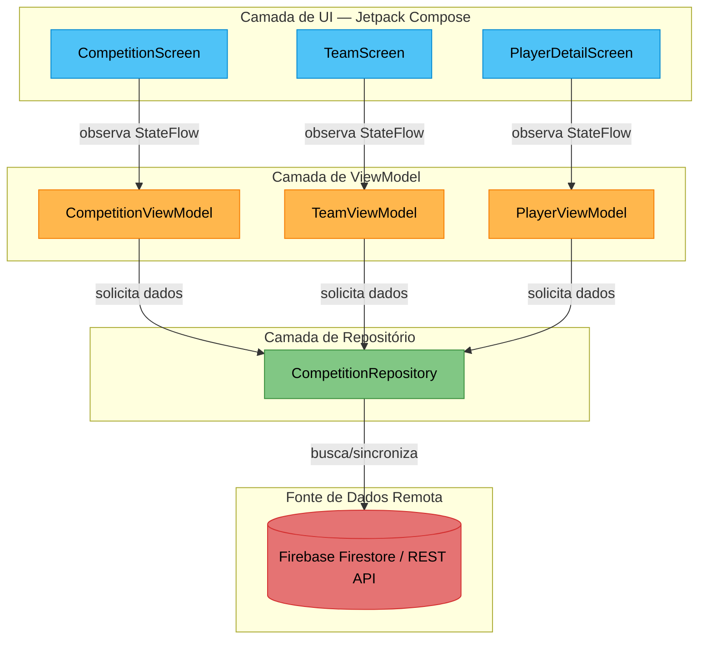
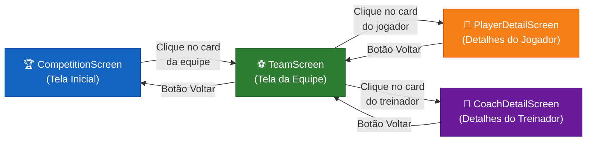
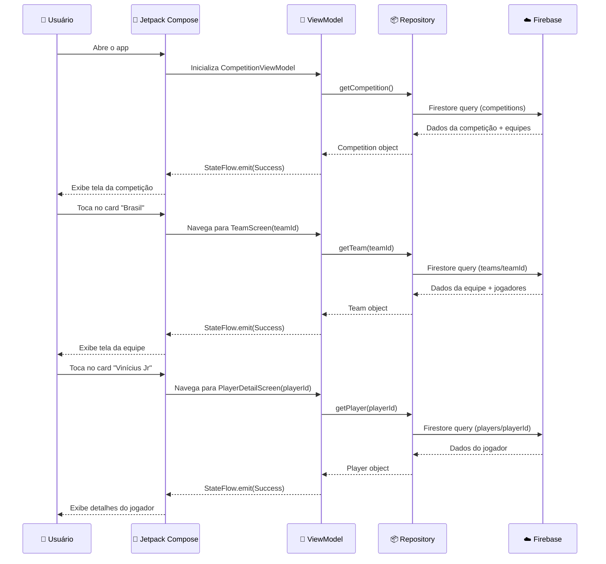

# 📘 Fase 1 — Requisitos e Modelagem

## Projeto: Álbum de Figurinhas Digital — Copa do Mundo 2026

**Disciplina:** FACOM32503 — Programação para Dispositivos Móveis  
**Professor:** Cláudio C. Rodrigues  
**Instituição:** Universidade Federal de Uberlândia — Bacharelado em Sistemas de Informação  
**Data de Entrega:** 26/06/2026  

---

## 1. Introdução

Este documento apresenta a entrega parcial da **Fase 1 — Requisitos + Modelagem** do projeto Álbum de Figurinhas Digital, uma atividade avaliativa da disciplina de Programação para Dispositivos Móveis.

### 1.1 Objetivo Geral

Desenvolver um aplicativo Android que simule um **álbum de figurinhas digital** para a Copa do Mundo 2026, permitindo aos usuários visualizar informações sobre a competição, equipes participantes, jogadores e treinadores, com navegação intuitiva e integração a uma base de dados remota.

### 1.2 Objetivos Específicos

- Aplicar conceitos de desenvolvimento mobile Android com **Jetpack Compose** e arquitetura moderna
- Exercitar práticas de **gestão de projetos em equipe**, com definição de papéis e responsabilidades
- Desenvolver competências em **modelagem de dados**, arquitetura de navegação e design de interfaces
- Integrar o app com **bases de dados remotas**, simulando cenários reais de consumo de APIs
- Consolidar o aprendizado em **testes funcionais e de usabilidade**

---

## 2. Requisitos Funcionais

| ID | Requisito | Descrição | Critério de Aceitação |
|---|---|---|---|
| **RF01** | Tela Inicial da Competição | Exibir o nome da competição ("Copa do Mundo"), a edição ("2026") e a imagem do troféu na tela inicial | A tela exibe corretamente o título, edição e uma imagem do troféu carregada da base remota |
| **RF02** | Listagem de Equipes | Exibir cards das equipes participantes contendo escudo, nome e número de vitórias | Ao abrir o app, os cards são carregados da base remota e exibidos em lista/grade scrollável |
| **RF03** | Tela da Equipe | Ao selecionar uma equipe, exibir: escudo ampliado, cores oficiais, selos de vitórias (ícones de troféus), descrição textual, e cards de 5 jogadores + 1 treinador | A navegação ocorre via NavHost e todos os dados são preenchidos dinamicamente |
| **RF04** | Tela de Detalhes do Jogador | Ao selecionar um jogador, exibir: foto, nome, posição, número da camisa e estatísticas | O usuário consegue visualizar todas as informações sem scroll excessivo |
| **RF05** | Tela de Detalhes do Treinador | Ao selecionar o treinador, exibir: foto, nome e descrição/perfil | Funciona de forma análoga à tela de jogador, adaptada ao contexto |
| **RF06** | Navegação Estruturada | Implementar fluxo de navegação entre telas usando NavHost do Jetpack Compose | O usuário navega Competition → Team → Player/Coach com botão de voltar funcional |

---

## 3. Requisitos Não Funcionais

| ID | Requisito | Descrição |
|---|---|---|
| **RNF01** | Interface Responsiva | A interface deve ser intuitiva, responsiva e adaptável a diferentes tamanhos de tela |
| **RNF02** | Código Modular | O código deve ser modular, bem documentado e seguir boas práticas de programação Kotlin |
| **RNF03** | Arquitetura MVVM | Utilizar o padrão arquitetural MVVM (Model-View-ViewModel) para separação de responsabilidades |
| **RNF04** | Testes | Implementar testes unitários (ViewModel/Repository) e testes de interface (UI) |
| **RNF05** | Controle de Versão | Usar Git com repositório compartilhado no GitHub, com branches por funcionalidade e pull requests |
| **RNF06** | Gestão de Tarefas | Utilizar GitHub Projects para acompanhamento de tarefas e progresso do desenvolvimento |

---

## 4. Modelagem de Dados

### 4.1 Entidades e Data Classes (Kotlin)

```kotlin
// Entidade principal da competição
data class Competition(
    val name: String,           // Ex: "Copa do Mundo"
    val edition: String,        // Ex: "2026"
    val trophyImage: String,    // URL da imagem do troféu
    val teams: List<Team>       // Lista de equipes participantes
)

// Equipe participante
data class Team(
    val id: String,             // Identificador único
    val name: String,           // Ex: "Brasil"
    val victories: Int,         // Ex: 5
    val description: String,    // Descrição histórica da seleção
    val badge: String,          // URL do escudo
    val colors: List<String>,   // Cores oficiais (hex) Ex: ["#FFD700", "#009C3B"]
    val players: List<Player>,  // Lista de 5 jogadores
    val coach: Coach            // Treinador da equipe
)

// Jogador
data class Player(
    val id: String,             // Identificador único
    val name: String,           // Ex: "Vinícius Jr"
    val position: String,       // Ex: "Atacante"
    val number: Int,            // Ex: 7
    val photo: String,          // URL da foto
    val stats: PlayerStats?     // Estatísticas (opcional)
)

// Estatísticas do jogador
data class PlayerStats(
    val goals: Int,             // Gols marcados
    val assists: Int,           // Assistências
    val matches: Int            // Partidas disputadas
)

// Treinador
data class Coach(
    val id: String,             // Identificador único
    val name: String,           // Ex: "Ancelotti"
    val photo: String,          // URL da foto
    val description: String     // Breve biografia / perfil
)
```

### 4.2 Diagrama de Entidades e Relacionamentos



---

## 5. Arquitetura do Aplicativo — MVVM

### 5.1 Visão Geral da Arquitetura

O app seguirá o padrão **MVVM (Model-View-ViewModel)** conforme recomendado pelo Android Architecture Components do Google:



### 5.2 Responsabilidades de Cada Camada

| Camada | Tecnologia | Responsabilidade |
|---|---|---|
| **UI (View)** | Jetpack Compose | Renderização das telas, captura de interações do usuário, observação dos estados via `collectAsState()` |
| **ViewModel** | AndroidX ViewModel | Lógica de negócio, gerenciamento de estado com `StateFlow`, mediação entre UI e Repository |
| **Repository** | Kotlin Coroutines | Acesso à fonte de dados remota, abstração da origem dos dados, tratamento de erros de rede |
| **Remote Data Source** | Firebase Firestore | Armazenamento e fornecimento dos dados da competição, equipes, jogadores e treinadores |

### 5.3 Gerenciamento de Estado

```kotlin
// Sealed class para representar os estados da UI
sealed class UiState<out T> {
    object Loading : UiState<Nothing>()
    data class Success<T>(val data: T) : UiState<T>()
    data class Error(val message: String) : UiState<Nothing>()
}

// Exemplo de uso na CompetitionViewModel
class CompetitionViewModel(
    private val repository: CompetitionRepository
) : ViewModel() {

    private val _uiState = MutableStateFlow<UiState<Competition>>(UiState.Loading)
    val uiState: StateFlow<UiState<Competition>> = _uiState.asStateFlow()

    init {
        loadCompetition()
    }

    private fun loadCompetition() {
        viewModelScope.launch {
            try {
                val competition = repository.getCompetition()
                _uiState.value = UiState.Success(competition)
            } catch (e: Exception) {
                _uiState.value = UiState.Error(e.message ?: "Erro desconhecido")
            }
        }
    }
}
```

---

## 6. Diagrama de Navegação

### 6.1 Fluxo de Navegação (NavHost)



### 6.2 Rotas do NavHost

```kotlin
// Definição das rotas de navegação
sealed class Screen(val route: String) {
    object Competition : Screen("competition")
    object Team : Screen("team/{teamId}") {
        fun createRoute(teamId: String) = "team/$teamId"
    }
    object PlayerDetail : Screen("player/{playerId}") {
        fun createRoute(playerId: String) = "player/$playerId"
    }
    object CoachDetail : Screen("coach/{coachId}") {
        fun createRoute(coachId: String) = "coach/$coachId"
    }
}
```

---

## 7. Diagrama de Fluxo de Dados



---

## 8. Especificação das Telas

### 8.1 CompetitionScreen — Tela Inicial da Competição

| Aspecto | Especificação |
|---|---|
| **Função** | Porta de entrada do app — estabelece a narrativa e identidade visual do evento |
| **Cabeçalho** | Nome da competição ("Copa do Mundo") + edição ("2026") com tipografia expressiva |
| **Destaque Visual** | Imagem central e imponente do troféu como elemento de maior peso visual |
| **Lista de Equipes** | Grade ou lista vertical de cards. Cada card contém: escudo, nome da seleção e número de vitórias |
| **Navegação** | Toque em um card navega para `TeamScreen` passando o `teamId` |
| **Estética** | Espaços em branco para evitar poluição visual; escudos coloridos como ponto focal |

**Wireframe conceitual:**
```
┌─────────────────────────────┐
│     🏆 Copa do Mundo 2026   │
│                             │
│        [Imagem Troféu]      │
│                             │
│  ┌──────────┐ ┌──────────┐  │
│  │ 🇧🇷 Brasil │ │ 🇦🇷 Argent.│  │
│  │ 5 vitórias│ │ 3 vitórias│  │
│  └──────────┘ └──────────┘  │
│  ┌──────────┐ ┌──────────┐  │
│  │ 🇩🇪 Aleman.│ │ 🇫🇷 França │  │
│  │ 4 vitórias│ │ 2 vitórias│  │
│  └──────────┘ └──────────┘  │
│  ┌──────────┐ ┌──────────┐  │
│  │ 🇮🇹 Itália │ │ 🇪🇸 Espanha│  │
│  │ 4 vitórias│ │ 1 vitória │  │
│  └──────────┘ └──────────┘  │
└─────────────────────────────┘
```

---

### 8.2 TeamScreen — Tela da Equipe

| Aspecto | Especificação |
|---|---|
| **Função** | Apresentar a identidade completa da equipe selecionada |
| **Identidade Visual** | Layout adota as cores oficiais da equipe nos elementos de UI (botões, divisores, fundo) |
| **Cabeçalho** | Escudo ampliado + nome da equipe |
| **Selos de Vitórias** | Linha de ícones de troféus representando as conquistas (1 ícone por vitória) |
| **Descrição** | Bloco de texto com a história/contexto da equipe |
| **Elenco** | Grade de cards (formato figurinha) para 5 jogadores + 1 treinador, com miniatura da foto e nome |
| **Navegação** | Toque no card → `PlayerDetailScreen` ou `CoachDetailScreen`; Botão voltar → `CompetitionScreen` |

**Wireframe conceitual:**
```
┌─────────────────────────────┐
│  ← Voltar                   │
│                             │
│     [Escudo Grande Brasil]  │
│        🇧🇷 Brasil            │
│    🏆 🏆 🏆 🏆 🏆  (5 títulos) │
│                             │
│  "Seleção Brasileira de     │
│   Futebol, pentacampeã..."  │
│                             │
│  ─── Elenco ───────────────│
│  ┌────┐ ┌────┐ ┌────┐      │
│  │Foto│ │Foto│ │Foto│      │
│  │Ney.│ │Vini│ │Case│      │
│  │ 10 │ │  7 │ │  5 │      │
│  └────┘ └────┘ └────┘      │
│  ┌────┐ ┌────┐ ┌────┐      │
│  │Foto│ │Foto│ │Foto│      │
│  │Alis│ │Marq│ │Ance│      │
│  │  1 │ │  3 │ │🎓  │      │
│  └────┘ └────┘ └────┘      │
└─────────────────────────────┘
```

---

### 8.3 PlayerDetailScreen — Detalhes do Jogador / Treinador

| Aspecto | Especificação |
|---|---|
| **Função** | Imersão individual — funciona como o "verso" ou ampliação da figurinha |
| **Foto** | Imagem em alta resolução ocupando a metade superior da tela |
| **Informações** | Nome, posição/função, número da camisa (jogador) — sobrepostos ou logo abaixo da foto |
| **Estatísticas** | Seção inferior com dados: gols, assistências, partidas (jogador) ou biografia (treinador) |
| **Navegação** | Botão "Voltar" no canto superior esquerdo → retorna ao `TeamScreen` |

**Wireframe conceitual:**
```
┌─────────────────────────────┐
│  ← Voltar                   │
│                             │
│                             │
│    [Foto Alta Resolução]    │
│       Vinícius Jr           │
│                             │
│                             │
│  ───────────────────────────│
│  Nome: Vinícius Jr          │
│  Posição: Atacante          │
│  Camisa: 7                  │
│  ───────────────────────────│
│  📊 Estatísticas            │
│  ┌────────┬────────┬───────┐│
│  │ Gols   │ Assist.│Jogos  ││
│  │   32   │   21   │  67   ││
│  └────────┴────────┴───────┘│
└─────────────────────────────┘
```

---

## 9. Estrutura de Pacotes do Projeto

```
com.grupo.albumfigurinhas/
├── 📂 data/
│   ├── 📂 model/
│   │   ├── Competition.kt
│   │   ├── Team.kt
│   │   ├── Player.kt
│   │   ├── PlayerStats.kt
│   │   └── Coach.kt
│   ├── 📂 remote/
│   │   └── FirebaseDataSource.kt
│   └── 📂 repository/
│       └── CompetitionRepository.kt
│
├── 📂 ui/
│   ├── 📂 screens/
│   │   ├── CompetitionScreen.kt
│   │   ├── TeamScreen.kt
│   │   └── PlayerDetailScreen.kt
│   ├── 📂 components/
│   │   ├── TeamCard.kt
│   │   ├── PlayerCard.kt
│   │   └── TrophyBadge.kt
│   ├── 📂 navigation/
│   │   └── AppNavGraph.kt
│   └── 📂 theme/
│       ├── Color.kt
│       ├── Theme.kt
│       └── Type.kt
│
├── 📂 viewmodel/
│   ├── CompetitionViewModel.kt
│   ├── TeamViewModel.kt
│   └── PlayerViewModel.kt
│
└── MainActivity.kt
```

---

## 10. Fonte de Dados Remota

### 10.1 Opção Recomendada: Firebase Firestore

**Justificativa:** Integração nativa com Android, SDK oficial, gratuito no plano Spark, tempo real e sem necessidade de servidor próprio.

### 10.2 Estrutura das Collections no Firestore

```
📁 competitions/
   └── 📄 copa_mundo_2026
       ├── name: "Copa do Mundo"
       ├── edition: "2026"
       ├── trophyImage: "https://..."
       └── 📁 teams/ (subcollection)
           ├── 📄 brasil
           │   ├── name: "Brasil"
           │   ├── victories: 5
           │   ├── description: "Seleção Brasileira..."
           │   ├── badge: "https://..."
           │   ├── colors: ["#FFD700", "#009C3B"]
           │   ├── coach: {name: "Ancelotti", photo: "https://...", description: "..."}
           │   └── 📁 players/ (subcollection)
           │       ├── 📄 neymar
           │       │   ├── name: "Neymar"
           │       │   ├── position: "Atacante"
           │       │   ├── number: 10
           │       │   ├── photo: "https://..."
           │       │   └── stats: {goals: 79, assists: 55, matches: 128}
           │       ├── 📄 vinicius_jr
           │       └── ... (5 jogadores)
           ├── 📄 argentina
           └── ... (demais equipes)
```

### 10.3 Exemplo de Acesso (Repository)

```kotlin
class CompetitionRepository(
    private val firestore: FirebaseFirestore
) {
    suspend fun getCompetition(): Competition {
        val doc = firestore.collection("competitions")
            .document("copa_mundo_2026")
            .get()
            .await()

        val teams = firestore.collection("competitions")
            .document("copa_mundo_2026")
            .collection("teams")
            .get()
            .await()
            .documents.map { teamDoc ->
                teamDoc.toObject(Team::class.java)!!
            }

        return Competition(
            name = doc.getString("name") ?: "",
            edition = doc.getString("edition") ?: "",
            trophyImage = doc.getString("trophyImage") ?: "",
            teams = teams
        )
    }
}
```

---

## 11. Princípios de Design Aplicados

| Princípio | Aplicação no Projeto |
|---|---|
| **Contraste e Hierarquia** | Troféu e escudos são os maiores elementos visuais; nomes usam tipografia bold |
| **Espaço em Branco** | Margens generosas entre cards evitam poluição visual |
| **Tipografia** | Fontes sans-serif para títulos e informações curtas (leitura rápida em mobile) |
| **Identidade da Marca** | Cada `TeamScreen` adota as cores oficiais da equipe nos elementos de UI |
| **Interatividade** | Cards com efeito de elevação/sombra ao toque; transições animadas entre telas |
| **Lúdico/Nostalgia** | Layout simula o formato de figurinhas físicas; selos de vitórias como ícones de troféu |

---

## 12. Plano de Apresentação Oral — Fase 1

> [!IMPORTANT]
> A apresentação da Fase 1 deve demonstrar o planejamento e a estrutura completa do projeto antes do início da codificação.

### Sequência Sugerida

| # | Tópico | Responsável | Duração |
|---|---|---|---|
| 1 | **Introdução** — Apresentação do tema, propósito e contexto da competição | Líder do Projeto | ~3 min |
| 2 | **Requisitos** — Requisitos funcionais e não funcionais; como os dados serão obtidos da base remota | Engenheiros de Dados | ~5 min |
| 3 | **Modelagem** — Diagrama de arquitetura MVVM; separação entre camadas; diagrama de navegação | Desenvolvedores Android | ~5 min |
| 4 | **Design e Layouts** — Protótipos das telas; justificativa de cores, ícones e tipografia | Designers/UX | ~5 min |
| 5 | **Encerramento** — Cronograma e entregas da Fase 2 | Líder do Projeto | ~2 min |

---

## 13. Distribuição de Tarefas — Fase 1

| Papel | Qtd | Tarefas na Fase 1 |
|---|---|---|
| **Líder do Projeto** | 1 | Coordenação geral, elaboração do documento de requisitos, preparação da apresentação, gestão do repositório GitHub |
| **Desenvolvedores Android** | 3 | Modelagem da arquitetura MVVM, definição da estrutura de pacotes, especificação das rotas de navegação (NavHost) |
| **Engenheiros de Dados** | 2 | Modelagem das entidades (Competition, Team, Player, Coach), definição da estrutura Firebase/API, criação do schema de dados |
| **Designers/UX** | 2 | Criação dos protótipos no Figma (3 telas), definição da paleta de cores, tipografia e iconografia, wireframes |

---

## 14. Checklist de Entrega — Fase 1

- [ ] Documento de requisitos funcionais e não funcionais
- [ ] Diagrama de arquitetura MVVM
- [ ] Diagrama de navegação entre telas
- [ ] Diagrama de fluxo de dados
- [ ] Modelagem das entidades (data classes)
- [ ] Estrutura do banco de dados remoto (Firebase)
- [ ] Protótipos de tela no Figma (CompetitionScreen, TeamScreen, PlayerDetailScreen)
- [ ] Estrutura de pacotes do projeto Android
- [ ] Apresentação oral preparada
- [ ] Repositório GitHub criado com README inicial

---

> [!TIP]
> Este documento pode ser convertido em slides para a apresentação oral. Cada seção principal corresponde a um bloco de slides.
